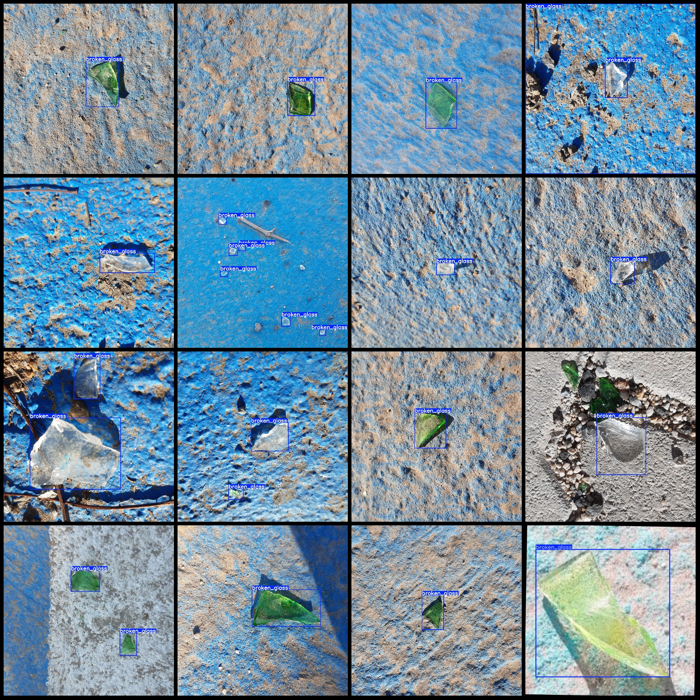
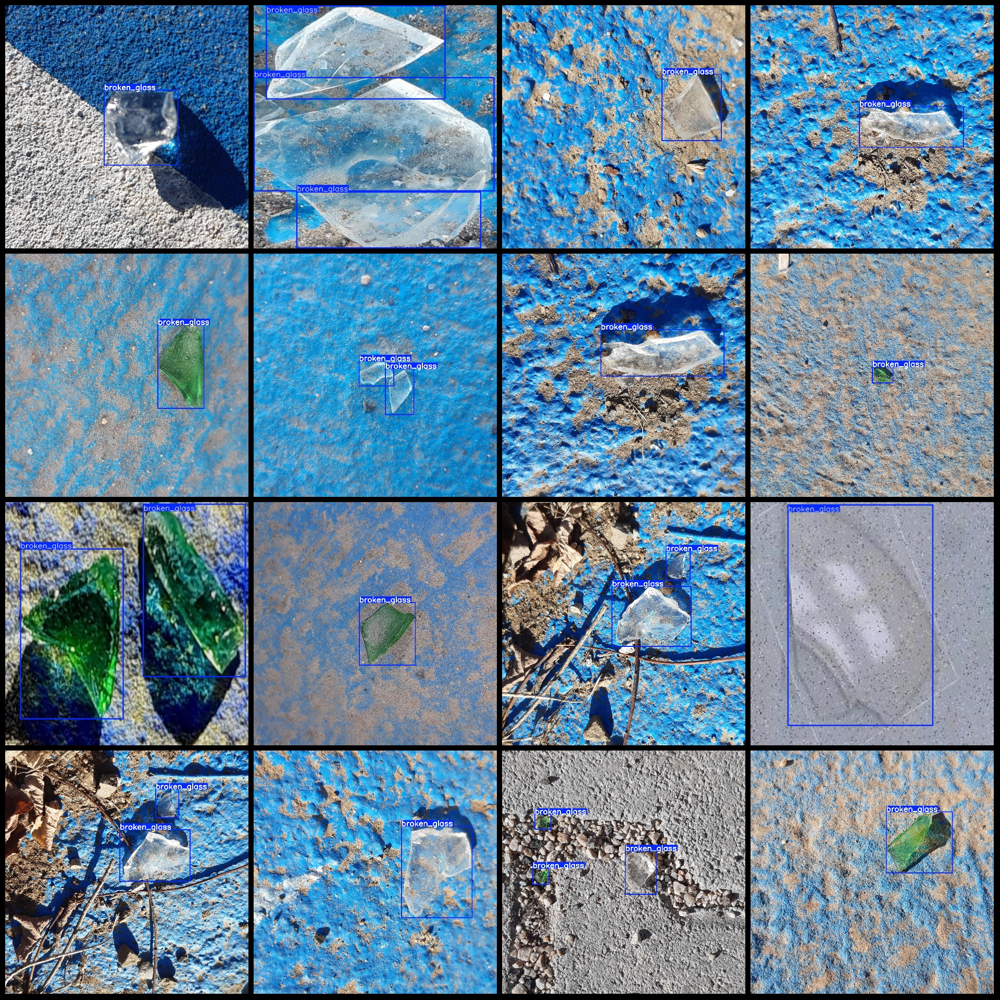

# Intelligent Traffic Road Pavement Glass Shard Detection Dataset VOC+YOLO format with 1276 images in 1 class

The dataset format: Pascal VOC format plus YOLO format (excluding the split path's txt file, only containing jpg images and corresponding VOC format xml files and yolo format txt files).

Number of images (jpg file count): 1276
Number of annotations (xml file count): 1276
Number of annotations (txt file count): 1276
Number of annotation categories: 1
Annotation category name: "broken_glass"
Number of bounding box per category: 
broken_glass bounding boxes = 1691
Total bounding boxes: 1691
Image resolution: 1920x1920 for 1000 images and 640x640 for 276 images.
Using labelImg for annotation
Annotation rules: drawing a rectangle around the category
Important notes: No specific instructions are provided at this time
Special notice: This dataset does not guarantee the accuracy of the trained models or weight files.
Image preview:
Annotation example:

## Image

Here is a pay link on Stripe ( https://buy.stripe.com/3cs8yP7sY87d0vu9AB ). Please contact me lonlonago@foxmail.com after funding $89, and I will send you a complete data files , thank you!

